# 🆕 ACL policy on great and irresponsible reviewers & chairs

**Great reviewers & chairs.** The biggest reward in performing peer review is helping your scientific field to develop further, and also getting to read the cutting-edge research in your area that may not yet be available anywhere. But now there's more than that. Starting from May 2025, ACL introduces the awards policy for reviewers & chairs (see more details [here](https://aclrollingreview.org/incentives2025)). In short, the area chairs or senior area chairs may nominate the great reviewers, and senior chairs may also nominate area chairs who perform great service. The nominees will then receive more recognition during the ACL conferences (public lists on conference webistes, special stickers for conference badges, more visibility in the program). They may also win a free virtual registration for an ACL event as an attendee (i.e. an event for which they would probably not have financial support of their organization).

Since peer reviewing is not often offered as a part of PhD school curriculum, ARR developed detailed guidelines and suggestions for each step of the process, including a list of common problems in both [reviews](#review-issues) and [NLP papers](#paper-issues) to watch out for.When you see a problem, you can refer junior reviewers to these materials and offer feedback.

**Irresponsible reviewers and chairs.** Unfortunately, with the growing number of conference submissions, there have been more and more cases where reviewers or chairs sign up for service and then simply disappear without a [warning](https://aclrollingreview/reviewerguidelines#emergency), or submit (meta-)reviews that are completely unacceptable in their quality (e.g. extremely terse, unprofessional in tone, LLM-generated).

Starting in October 2024, ARR provided the authors with the opportunity to report common issues with reviews (e.g. rude reviews, 'not novel' criticism without providing references, etc.) The ACs will see such reports, if any, judge their merit, and take them into account when writing the meta-review. A similar functionality has now been [developed](https://aclrollingreview.org/authors#step3.2) for meta-reviews, with author issue reports viewable for senior area chairs. Since the reviewer and AC guidelines may also seen by the authors during the response period, some sections of these guidelines now have codes for (meta-)review issues (I1-I12) that can be reported by the authors. More details [here](https://aclrollingreview.org/authors#step2.2) and [here](https://aclrollingreview.org/authors#step3.2).

Starting in May 2025, ARR also adopts the new [policy](https://aclrollingreview.org/incentives2025) on the 'highly irresponsible' (meta-)reviewers. The program chairs and ARR EiCs will consider the egregious cases reported by chairs (on their own judgement or based on author reports), including the cases of extremely terse reviews, unprofessional tone, and LLM-generated reviews. The 'highly irresponsible' reviewers may become ineligible to (re-)submit or commit their work during the following ARR cycle. For review cycles associated with ACL conferences, this means that the papers of such reviewers cannot be committed to the upcoming conference. After the author response period ACs can report both great and irresponsible reviews via a [new form on reviews](#review-direct-flagging) or by listing the great/irresponsible reviewers [in the meta-review form](#metareview-form-flagging).

# Area Chairs tasks and due dates

ACs are instrumental in completing the review process on time and with the highest reviewing quality standards possible. We are committed to completing all reviews on time (a complete review process means all papers have three reviews, one meta-review, and possibly ethics reviews as appropriate). The process has been highly stressful in the past, and ARR has now switched to [10-week review cycles](https://aclrollingreview.org/dates). This is still fairly tight, but there will now be more time for author response, and the deadlines will be more aligned with week days. The exact dates for AC tasks in each cycle are communicated by an email from OpenReview (OR). Usually the email subject is *[ACL RR-(MONTH)] AC kick-off email: Check paper reviewer assignments*. 

If you are new to this, a very useful source of advice for planning your time is in a [blog post by Annemarie Friederich](https://annefried.github.io/posts/2020-12-01-area_chairing). The [FAQ](#faq) in this document describes how to do common tasks in OpenReview.

Starting from February 2025, we have optimized AC assignments so as to minimize the number of SACs with which a given AC works. The scope of this problem should now be significantly decreased, but it is still possible that the papers in your batch are assigned to more than one SAC, and therefore you may receive communication from different SACs, especially if you are running late on your ToDos. The best way to avoid multiple SACs reaching out to you would be to complete your tasks on time.

We apologize in advance: you might receive ARR-related correspondence redundantly and/or at inconvenient times. ARR is manned by people spread across the globe, and as a result, emails and deadlines sometimes fall onto time/days that are convenient for one location but not others. We kindly ask for your understanding and hope that you can still help within your own time constraints.

> ❗ **If at any point in the cycle you find that your ability to perform AC duties was compromised due to a personal emergency, please fill out the [Emergency Declaration form](https://aclrollingreview/reviewerguidelines#emergency) on your paper(s) as soon as possible.** If there is no record in the forum, the PCs and SACs cannot all see the status and ensure that appropriate action is taken. This may get ACs flagged as 'highly irresponsible'. If you are running late with your meta-review, please let us know via the new [Delay Notification Form](https://aclrollingreview/reviewerguidelines#delay).

# ✅ **TASK 1. Initial submission checks**

The first thing to check is whether you happen to know the paper and have a conflict of interest with it, or feel that it is completely out of your field of expertise. This is not a frequent phenomenon, but if it happens to you -- please reach out to your SAC and request a reassignment immediately.

## Checking reviewer assignments

Check the quality of reviewer assignments and make changes if needed. When you change assignments, **please do not assign reviewers already at max load**. When you add a new reviewer to a paper, **do not forget to remove an existing reviewer**. At this point in the process, you can only use the reviewers already in the pool, and cannot bring in new reviewers. 

Go to your Area Chair Console for the month of your cycle. The link looks as follows: https://openreview.net/group?id=aclweb.org/ACL/ARR/YEAR/MONTH/Area_Chairs   For example, October 2024 cycle AC console is at [https://openreview.net/group?id=aclweb.org/ACL/ARR/2024/October/Area_Chairs](https://openreview.net/group?id=aclweb.org/ACL/ARR/2024/October/Area_Chairs)

Then click on the Modify Reviewer Assignments Link

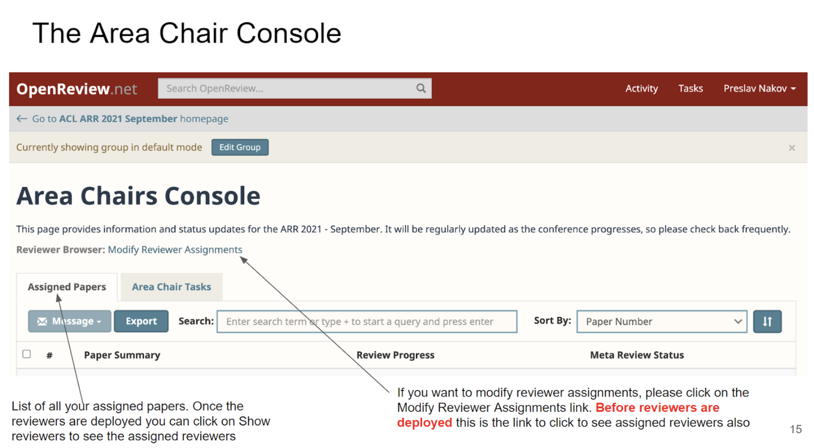

You should now see an interface that allows for viewing candidate reviewers. On the right there is a checkbox for viewing only the reviewers with fewer assigned papers than their max load. You can also order the results by assignment, affinity scores, seniority, status, research area, and other criteria (see also [FAQ](#openreview-how-to-assign-reviewers) on this). The reviewer names are linked to their OR profiles, which contain links to Google scholar, semantic scholar, DBLP, ACL Anthology. You are also shown their affiliations, which will help with your assessment of diversity of assignments.

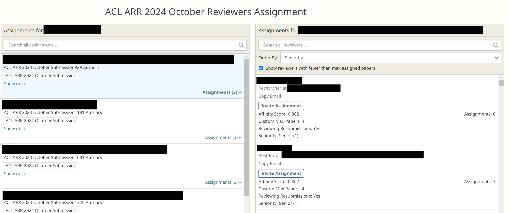

Tips on working with the reviewer browser interface: 

 - `Research area` field is unfortunately not shown for all reviewers, because some of them did not fill it in. You can also click on the reviewers' names to open their OR profiles, which contain links to Google Scholar etc.
 - `Status: requested` means that this paper is a revision, and this reviewer reviewed the previous version, and the authors requested for them to be assigned again. More on resubmissions [here](#how-to-check-reviewing-assignments-for-resubmissions).
 - `Affinity score` is described [here](#how-to-interpret-reviewer-affinity-scores-how-to-interpret-reviewer-affinity-scores).
 - `Seniority` flag indicates whether the reviewer qualifies as senior by the current ARR criteria.

You need to perform the following checks and tasks:

- [ ] Each paper has to have **exactly three reviewers** assigned. Please, at this initial stage, do not assign more than three reviewers to a paper! In large cycles, we are at the limit of our reviewing capacity and we cannot afford to waste reviewers effort. You can easily check for this by going to your 'Assigned submissions' list, and entering `+numReviewersAssigned>3` in the search field.
- [ ] **Reviewers should be assigned more papers than their maximum load. Please help us maintain this limit.** You can check this by going to "modify reviewer assignments interface". Clicking on each paper should bring up the list of assigned reviewers, and for each reviewer you should be able to see their "max papers" and "assignments". If you see any reviewer whose current number of assignments is bigger than the "max papers", please find replacement reviewers who are still under their maximum load within OR. There is a checkbox that implements that filter, as shown in the screenshot above.
- [ ] At least one (ideally two) of the reviewers is past the postgraduate degree stage. Check the Seniority flag, if it’s set to 1, it should mean the reviewer is not a student (there was a bug in the past where this was set incorrectly for some profiles, it should be fixed now). Instructions for interpreting affinity scores are [here](#how-to-interpret-reviewer-affinity-scores). 
- [ ] The assigned reviewers should also be diverse in terms of affiliation and geography. The above interface for reviewer assignments shows affiliations of reviewers to help you assess that.
- [ ] Check that **resubmissions are handled appropriately**. Instructions [here](#how-to-check-reviewing-assignments-for-resubmissions). 

## How to Check Reviewing Assignments for Resubmissions 

Identify resubmissions as follows: when you click on the title of a paper in the Assigned Papers tab, it brings you to a page with full details of this paper. In the *Supplementary Materials by Program Chairs Section* of this page, iff the paper is a resubmission, it will show a Previous URL link as below (there will be no such link for papers that are not a resubmission):
    
{:width="50%"}
 
(The presence of the link indicates resubmission)

Click the “previous url” link to see the original reviewers. **It is important to check that the same past reviewers have been assigned to this resubmission**, unless the authors requested new reviewers. 



The paper reviewer matching algorithm should do this for reviewers in the pool. But we still request your help double-checking that this is the case. If the original reviewers were not assigned, and the authors didn’t request a change of reviewers, we need your assistance in reassigning the same reviewers to the paper. There are several possible scenarios:

1. **Original reviewers of the resubmission are in the pool and not at max capacity:** assign them to the resubmission.
2. **Original reviewers are at max capacity, but they are assigned another paper(s) in your batch that you can reassign**. Please shift other papers away from the reviewers needed for the resubmission, and assign them to the resubmission.
3. **Original reviewers are at max capacity, but none of their assignments are in your batch.** OpenReview doesn't allow for shifting reviewers away from papers you don't AC, so unfortunately you will need to replace them with new reviewers, or reach out to them and ask if they would kindly take on this revision.
4. **Reviewers of the resubmission are not in the pool or have set a max load of 0**. Then we ask that you contact them directly via personal email about this resubmission and ask if they can return to work on this single paper. If they say yes, please add them as reviewers and remove the new reviewer automatically assigned by Openeview (OR). You may need to ask the ARR editors to modify the resubmission reviewer’s max load to 1 so you can assign them this resubmission. 

What about the AC, i.e. yourself? If this is a resubmission, and the authors requested the same AC, but you did not AC this paper previously - this means that the original AC was unavailable in this cycle and hence could not be assigned. 

## Completing the AC checklist

For each submission, you need to **complete the AC checklist**. It reports on the above reviewer assignment checks, and it also asks ACs to verify that papers follow the call for papers and submission guidelines, including: 

 - [ ] Is the paper appropriate for *ACL venues?  
If in doubt, consider the scope described in [ARR CFP](https://aclrollingreview.org/cfp) and the CFP of any conferences associated with a given review cycle
 - [ ] Is the paper properly formatted according to the [ACL guidelines](https://acl-org.github.io/ACLPUB/formatting.html)? Please note that ACL has separate LaTeX and Microsoft Word templates, and PDFs produced by these templates look different from each other.  
 - [ ] Does the paper have the proper length?  
Short papers: 4 content pages maximum, Long papers: 8 content pages maximum. Sections on ethical considerations and limitations do not count towards page limit.
 - [ ] Does the paper have a section entitled "Limitations"?
 - [ ] Is the paper properly anonymized?   
TLDR: no clear self-citations, acknowledgements, or non-anonymous repository links. Resources also shouldn't be linked from services like Dropbox, which may track who opened the links
 - [ ] Is the [Responsible Checklist](https://aclrollingreview.org/responsibleNLPresearch/) filled appropriately?   
Starting from December 2024, egregious violations of the checklist may qualify for desk rejections (e.g. some authors just say 'yes' for all questions, even  for questions that do not even apply to their work, or not provide any justifications when they are needed based on their responses). Minor honest mistakes can be excused (e.g. the information is provided in a different section than specified, due to some last-minute editing). 
 - [ ] Does the submission have [3 reviewers](#checking-reviewer-assignments)?  
We cannot afford more than 3. Please remove an assignment if you add another reviewer 
 - [ ] Are the reviewers [diverse, in regards to seniority, geographies, and institutions](#checking-reviewer-assignments)? This criterion should be respected as much as possible with the available reviewer pool.
 - [ ] Should this paper be sent for an in-depth ethics review? (if so, you need to provide a justification).  
Please refer to the [Guidelines for ethics review flagging](https://aclrollingreview.org/ethics-flagging-guidelines/). Ethics process happens in parallel to the main review process, so **without your flagging problematic papers in this checklist, the ethics review process cannot start on time.** 
 
 If the paper is a resubmission: 
 
 - [ ] does the [link to the previous submission](#how-to-check-reviewing-assignments-for-resubmissions) work?
 - [ ] has the authors' request regarding keeping or changing reviewers been respected?   
If not, answer 'No' and please modify the assignments as described [here](#how-to-check-reviewing-assignments-for-resubmissions).
- [ ] is it accompanied by revision notes listing the changes made? (field: 'explanation of revisions PDF').

Most adjustments to reviewer assignments need to happen on this stage. After ARR releases reviewer assignments, making changes will be a lot more work for you, as you would need to notify both the newly assigned and un-assigned reviewers. 

If you see something that you suspect to be a violation of publication ethics policy (e.g. plagiarism, violation of rules on generative AI, near-duplicate submissions, author misconduct), or a reviewer alerts you about such a suspicion, please coordinate the filing of an [incident report process for the publication ethics committee](/acguidelines#pec) as necessary, by either the reviewer, AC or the SAC. Please also leave a note about this in the forum (visible to chairs but not authors), so that there is a record of what was done.

## How to Interpret Reviewer Affinity Scores {#how-to-interpret-reviewer-affinity-scores}

Affinity scores reflect just content matching of the reviewer’s own papers with the content of the submission. Aggregate scores incorporate affinity scores, track matching, and other criteria. See the table below for an interpretation of the score ranges.

<table>
  <tr>
   <td>Score Range
   </td>
   <td>Interpretation
   </td>
  </tr>
  <tr>
   <td>[3] 
   </td>
   <td>The paper is a resubmission and the authors request the same reviewers. These reviews are unweighted. Do not change this assignment.
   </td>
  </tr>
  <tr>
   <td>[1,2]
   </td>
   <td>Paper track matches reviewer reviewer-specified track
   </td>
  </tr>
  <tr>
   <td>(0,1)
   </td>
   <td>Reviewer’s track doesn’t match the paper track. Note that some reviewers may be missing track information.
   </td>
  </tr>
  <tr>
   <td>0
   </td>
   <td>Paper is a resubmission and the authors requested a new set of reviewers. These reviewers are not to be assigned to the paper.
   </td>
  </tr>
</table>

Pay special attention to _generic_ tracks of “NLP Applications” and “Machine Learning for NLP”. If your assigned paper(s) belong to these tracks, you may wish to check the reviewer assignments more carefully, as the automated system may not be that good. You may assign a reviewer even if their track does not match, as long as you believe they will be willing to review and are an expert on the paper’s topic.

If you would like to add a reviewer to the pool, at this stage please do this by contacting the editors-in-chief at [editors@aclrollingreview.org](mailto:editors@aclrollingreview.org). At emergency reviewer assignment stage the process will be a bit different, as will be described below.

## Do NOT Actively Search for the Paper Title Online! {#do-not-actively-search-for-the-paper-title-online}

Neither ACs nor reviewers should actively seek for non-anonymized versions of the papers that they are reviewing. Reviewers are advised to reach out to ACs and request reassignments or at least disclose in the review form that the review was not anonymous. The reviewer guidelines  contain instructions to reach out to ACs and ask for reassignment when the reviewers feel that their judgement would be compromised by the lack of anonymity. Whenever possible, please honor such requests and reassign reviewers, especially when they find out the identity of authors they are well familiar with. 

# ✅ **TASK 2. Ongoing review checks**

At this stage, we ask you to check in a few times to see the reviews as they come in, and react to any low-quality reviews if you see any (see [the next section](#-task-3-checking-review-quality-and-chasing-missing-reviewers) for a list of common review problems). It may not always be possible, but ideally we'd catch as many low-quality reviews as we can, without the authors ever being exposed to them. For inexperienced reviewers, this process provides them with feedback and training (as well as possibly awards and recognition).

If you see a review that needs improvement, you can contact the reviewer by posting an official comment and selecting that reviewer as the reader for the comment. Add your SACs (Senior Area Chair) so they’re in the loop. 

If a reviewer needs to be replaced in the process for some legitimate reason, e.g. when they reach out to report a newly discovered COI or some emergency situation, please unassign them and invite a new reviewer. You can see which reviewers are qualified and still have room for more assignments in the  “Modify Reviewer Assignment” link from your AC console. **If you modify any assignments after they have been sent out to reviewers, you have to contact the reviewers and notify them** (OR does not do that automatically). 

If you need to replace a reviewer because they might be unreliable, please do *not* unassign them when you add a new reviewer. Incomplete reviews is one of the mechanisms through which we identify unreliable reviewers. . 

# ✅ **TASK 3. Checking review quality and chasing missing reviewers**

To the extent possible, we ask you to do at least a surface check that **the reviews in your batch are of reasonable quality**. Common problems that are relatively easy to spot without in-depth reading are: 

- one-liner reviews 
- rude reviews 
- reviews where the low scores are not accompanied by substantial criticism 
- reviews with blanket non-specific statements (e.g. saying "not novel" without references, 'too few experiments' without specifying what is missing, etc.) 
- some of the [common heuristics discussed in the reviewer guidelines](https://aclrollingreview.org/reviewerguidelines#3-check-for-common-review-issues-i2-i10), such as 'this is a resource paper', 'results are not sota'. Note that it contains new instructions about requests for comparisons to the latest 'closed' models. 
- reviews that have clearly problematic content that is not based on sufficient understanding of the submission, and may have been LLM-generated. Neither reviewers nor ACs are supposed to rely on LLMs for content, and using commercial LLMs even for language checking also violates confidentiality rules.

If you notice any such obvious problems, there's still time to contact the reviewer and ask them to fix them. Junior reviewers may be able and willing to do a better job if you ask them directly to fix a specific issue. If non-responsive, proceed with emergency reassignments. The reviewers have been provided with extensive [reviewer guidelines](https://aclrollingreview.org/reviewerguidelines). Please check if you have anything seriously problematic in your batch, and if so - please reassign these papers to emergency reviewers. 

In the rare cases of serious malpractice you may see reviews that are so bad that they should be removed from consideration. Please note such cases down, you will be able to [specify this in the meta-review or review rating form](#review-flagging). If by the start of reviewer discussion you have any reviews that are so problematic that they should be removed, please add an official comment on them, addressed to chairs and authors, with the following text: *"This review does not meet the ARR quality standards, and will be disregarded in the assessment"*.

Between-reviewer discussion is less common on OpenReview, but if you happen to notice a case where that might be warranted (e.g. that reviewers contradict each other), you can point that out and invite them to discuss it before the start of author response. OR has a new [chat feature](#openreview--how-to-use-the-chat-feature) that may help with this.

**Review chasing.** You will likely have some reviews missing by the reviews-due deadline. You can easily check which papers have missing reviewers by going to your 'Assigned submissions' list, and entering `+numOfficialReviewDone<3` in the search field. Some of them may find that they are unable to complete some or all of their reviews due to personal emergencies; in these cases we ask them to notify you as soon as possible by filling out the [Emergency Declaration form](https://aclrollingreview.org/reviewerguidelines#emergency) on the page for the paper. See if there are any such declarations. Some of them may be running late but do not need to be replaced, in this case we asked them to fill out the new [delay notification forms](https://aclrollingreview/reviewerguidelines#delay).

You can do the following:

1. Contact the reviewers who are late and have not submitted the [emergency declaration](https://aclrollingreview/reviewerguidelines#emergency) or [delay notification](https://aclrollingreview/reviewerguidelines#delay), and ask when they will submit their reviews. Many are late but do submit their reviews with some chasing. From past experience, it is more effective to reach out personally by email rather than through OR. If they confirm that they will submit their reviews before the start of author response period, then there is no need to assign emergency reviewers. You can remind them of the new policy on [highly irresponsible reviewers](https://aclrollingreview.org/incentives2025).
2. If the original reviewers have submitted the emergency declaration, or are unresponsive, or they say that they cannot complete the reviews before the start of author response period, bring in emergency reviewers. **Each unresponsive reviewer should have exactly one replacement**. Many ARR cycles run at max reviewer capacity, so we cannot afford to spend more effort on one paper.

There are three ways to find and invite emergency reviewers:

1. **Find reviewers on OpenReview.** Once you click on “Edit Reviewers Assignments”, you will get a list of reviewers registered for this cycle. For each one, there will be 'copy email', 'invite assignment', and 'assign' buttons. It may seem intuitive to send 'invite assignment' to reviewers, but this may not be effective. A better approach is to **email them first**, choosing those who do not already have too many assignments (see their 'max load' number). Depending on the urgency, you can even email 3 or 4 at a time (remember to bcc them). You then **click on “invite assignment” only for the one who answers first**, and thank the others for volunteering. This way you end up with a responsive reviewer, which you can probably trust to submit reviews in time. **You should add only one extra reviewer to the paper**, instead of inviting 3 emergency reviewers and ending up with 6 reviewers in a single paper by accident. See [here](#openreview-how-to-assign-emergency-reviewers) for screenshots for how to use emergency reviewers from ARR pool. 

2. Reach out to volunteers on BlueSky or another social network with high participation of researchers. E.g. here is how one AC approached this: https://bsky.app/profile/tpimentel.bsky.social/post/3lbetra6awk25. 

3. Reach out to people in your own network. If you are an AC, you probably know other people in the NLP community. You can reach out personally to specific people who you believe have the expertise for a specific paper, and ask them if they would be willing to do an emergency review. If it's a junior researcher, it is a good idea to offer to give feedback on their review, especially if it’s their first time reviewing.

When you are adding someone who is not already in the reviewer pool, you can add them yourself. See screenshots for how to do this [here](#openreview-how-to-assign-reviewers). Do not remove the unresponsive reviewer; this information is collected for ARR statistics. 

In some cases, the reviewers may have already reached out to us or SACs, and an emergency reviewer may have already been assigned. If you see that some of your papers suddenly have 4 reviewers, this is probably what happened. Unfortunately OR doesn't show the emergency status of such assignments. If you need to know who is the emergency reviewer, you will have to ask the reviewers directly.

See how to contact SACs, EiCs, and reviewers [here](#openreview-how-to-contact-sacs-reviewers-eics).

# ✅ **TASK 4. Reviewer-author discussion period**

At this stage, the authors are the main drivers of the discussion, and you do not have any big tasks. Authors are not obligated to respond, but when they provide a response, the reviewers are [encouraged](https://aclrollingreview.org/reviewerguidelines#-task-4-update-your-assessment-after-the-authors-response-and-discussion-i11) (but not obligated) to at least acknowledge it. If you notice that some discussion becomes openly hostile and unprofessional, you are welcome to step in and remind the participants about the [ACL anti-harassment policy](https://www.aclweb.org/adminwiki/index.php?title=Anti-Harassment_Policy).

# ✅ **TASK 5. Meta-review**

If you are not yet familiar with OR interface, instructions for submitting the meta-reviews are [here](#openreview-how-to-submit-meta-review).

## Meta-review form 

Generally, a meta-review is a summary of the reviews, discussions, and author response, providing a recommendation to the chairs. It should state the most prominent strengths and weaknesses of the submission, and it should explicitly judge whether the former outweighs the latter (or vice-versa). It should help the **authors** figure out what type of revision (if any) they should aim for, and it should help the **chairs** make accept/reject decisions. Like reviews, meta-reviews should be [specific](https://aclrollingreview.org/reviewerguidelines#2-be-specific-i1) (especially about the recommended revisions), and [professional in tone](https://aclrollingreview.org/reviewerguidelines#6-check-that-the-tone-is-professional-and-neutral-i4) (rather than rude/dismissive).

🆕 The ARR **metareview score** has changed in February 2025 to be more aligned with reviewer scores. [Like with reviews](https://aclrollingreview.org/reviewerguidelines#5-check-that-your-scores-reflect-the-review-i3), the score should be backed up by the meta-review text. The new options are:

5 = Consider for Award: I think this paper could be considered for an outstanding paper award at an *ACL conference (up to top 2.5% papers).

4.5 = Borderline Award

4.0 = Conference: I think this paper could be accepted to an *ACL conference.

3.5 = Borderline Conference

3 = Findings: I think this paper could be accepted to the Findings of the ACL.

2.5 = Borderline Findings

2 = Resubmit next cycle: I think this paper needs substantial revisions that can be completed by the next ARR cycle.

1.5 = Resubmit after next cycle: I think this paper needs substantial revisions that cannot be completed by the next ARR cycle.

1 = Do not resubmit: This paper has to be fully redone, or it is not relevant to the *ACL community (e.g. it is in no way related to computational processing of language).

 
Outstanding papers should be either fascinating, controversial, surprising, impressive, or potentially field-changing. Awards will be decided based on the camera-ready version of the paper (see the [ACL award policy](https://www.aclweb.org/adminwiki/index.php/ACL_Conference_Awards_Policy)).

Starting with February 2025, ARR reviewers are asked to provide three scores: soundness, excitement, and overall recommendation. All papers recommended for Findings or main conference are expected to be sound and reproducible. The ACs should mostly follow the soundness assessment of the reviewers when they are in agreement, and they can weigh in when there is a disagreement or serious issues with reviews.

The Findings/main conference distinction is about selecting among all the good papers those that are distinguished in some respect and have no other issues. There are not necessarily further improvements that could be recommended to the Findings papers. A main conference paper could be distinguished by excitement, novelty, impact, and/or other factors, considered case-by-case. Reviewer excitement is neither necessary nor sufficient condition: it is possible that the reviewers find the paper 'exciting', but the AC recommends it for Findings because some other consideration outweighs it. It is also possible for a less 'exciting' paper to be recommended for the main track. For example, improvements in efficiency of some algorithm, or creating a high-quality resource for a language/domain that does not yet have resources of that type may not sound very novel or exciting, but you may still consider it a significant contribution due to its potential impact (for its target community).

The papers recommended for main conference, Findings and even awards may still have some minor points of improvement (e.g. clarifications, non-core references, data presentation). No paper is perfect, and the judgements should be relative to the pool of conference submissions, and not e.g. Nature papers.

If you do not recommend the paper for either the main conference or Findings, the meta-review should clearly signal, both to the authors and to program chairs, what work it would take for this paper to be publication-ready. There are now two tiers for papers recommended for resubmission, depending on the amount of work that is needed. 

**"Summary of reasons to publish"** is not just a list of contributions the authors state but rather the contributions that are acknowledged by the reviewers. **"Summary of suggested revisions"** should be clear revisions that you recommend and that you would expect the authors to address if they chose to revise-and-resubmit this paper.

**Flagging papers for ethics.** Generally, this was supposed to happen at the AC checklist stage. If this does happen, it is generally too late to send this to the ethics reviewers in the same cycle. ARR is currently developing a process for such cases. For now, we ask you to still provide this information if you strongly believe that some big ethical problem has been missed.

**Outstanding paper award.** You, just like the reviewers, have the power to nominate the paper to be considered by the best paper committee. This does not mean that the paper is perfect (none of them are): you could consider the papers that seem outstanding in your batch. The current [ACL award policy](https://www.aclweb.org/adminwiki/index.php/ACL_Conference_Awards_Policy) allows for up to 2.5% of papers to receive 'outstanding' awards, which could mean a lot for junior authors' careers - but relatively few papers even get nominated. 

## Sources of information for meta-review

**Reviews.** This part is the most-cut, since the reviews are comparably structured and you are already familiar with the reviewers' positions at this point. However, please consider also the author response, where available, and reported review issues that were justifiably flagged by authors (see below). Note that according to the [ACL anonymity policy](https://www.aclweb.org/adminwiki/images/5/56/ACL_Anonymity_Policy.pdf) (see recommendation 'c' on p.2), **you should not rely on reviews where the reviewers were biased by the knowledge of the authors' identity**. To help you estimate that, the review forms contain the question 'Knowledge of/educated guess at author identity'.

**Author response.** Please take into account both the criticisms and the author response to them. Often the reviewer criticisms are based simply on misunderstandings or missing some details in the papers. If the authors provided satisfactory clarifications, and the paper could be amended relatively easily, this is a case of minor revisions. Otherwise the meta-review should be clear what needs to be addressed in the resubmission.

Sometimes authors and reviewers engage in very deep and long discussions, and it is not feasible for ACs to read all this. The instructions to both authors and reviewers currently say that we ask you to read at least 2 author responses per review thread.

🆕 **Reported review issues.** Starting from October 2024, during author response, the authors will be able to flag problematic reviews for specific review issues in a new form. We ask you to check whether there were any such complaints in the paper forum. If there were, you need to consider whether they were reasonable. The authors are supposed to identify the type of the issue (marked as I1-12 provide justifications for why they think the reviewer violated the guidelines. Most of the possible review issues (except I5,I8-9,I11-12) are specifically mentioned in the [reviewer guidelines](https://aclrollingreview.org/reviewerguidelines), and we provide the issue codes there so that you could easily search in the document and find the find the relevant section. Author form and instructions can be viewed [here](https://aclrollingreview.org/authors#step2.2). **You need to consider whether the complaint is reasonable and state that you either took the issue(s) into account in your meta-review, or that you did not find the complaint(s) justified**. The meta-review form contains new checkboxes for these options. If multiple issues are reported, and some are justified and some are not, please check both checkboxes. You are welcome (but not obligated) to also provide the authors a brief response to their complaint (there is a dedicated text field for that).

**Adding new information.** You are an area chair because you are an expert in the field; you do not have to simply average across reviewer scores and summarize their comments. You are also welcome (but not obligated) to read the paper, especially when the reviewer arguments are hard to understand without some additional context. That being said, the authors have a chance to respond to reviewers but not to area chairs, and so we ask you to bring in new criticisms only when you strongly believe that the reviewers overlooked something crucial, and to substantiate them. For transparency for the authors, please mark the issues newly raised by you (e.g. 'AC note: ___'). We also ask you to mention any other important developments that they did not observe (e.g. that there was extra reviewer discussion and reviewers reached consensus or identified new issues).  

**Using reviewer discussion to resolve disagreements.** If you have reviewers who strongly disagree with each other, it is a good idea to start a discussion by asking reviewers to read each others’ reviews and see whether there is anything else to add. A reviewer may see a point that causes them to change their score, or one reviewer may help clarify something about the paper that another reviewer was confused about. You are welcome to initiate a discussion either before or after the author response period in the cycle. The reviewers are more likely to engage if you provide the specific issue about which there is disagreement, and which you'd like to discuss.

It is OK if differences between reviewers remain as long as you understand the rationale behind the disagreement. In some cases, such as position papers, this may be a signal that the community is divided and the paper brings up an important issue for the community to discuss. Note if there are any 'champion reviewers' who are willing to fight for a paper: this could also be a signal that at least some part of the community feels strongly that this issue is important.

**Using reviewer discussion to decide on revisions to request.** The discussion can also serve to get the reviewers to agree on top priorities for revision when the reviews contain many suggestions. It may help to list what you see as the top opportunities for improvement and ask reviewers whether they would raise their score for a revision that satisfies those points.

Also, keep in mind that resubmissions do not have a higher page limit for addressing reviewer feedback, so if major additions are suggested, consider asking reviewers what can be removed to make space (or whether the format should be switched between short and long).

**Can I use AI assistants for summarizing the reviews and discussions?** Meta-reviews, discussions and reviews are confidential materials, and as such, per [ACL publication ethics policy](https://www.aclweb.org/adminwiki/index.php/ACL_Policy_on_Publication_Ethics#Guidelines_for_Generative_Assistance_in_Authorship) they **should not be submitted to non-privacy-preserving third-party services** (i.e. those that may store and/or use input user data for third-party services). The use of privacy-preserving tools is also governed by that policy: it is permissible for language/input assistance, but you are fully responsible for the content. If you end up providing a certain recommendation because the automated summary simply missed a key aspect of reviews or author response (within the recommended discussion length), that will be your responsibility.

## 🆕 Great reviews and unacceptable reviews {#review-flagging}

### Reporting great/unacceptable reviews through the meta-review form {#metareview-form-flagging}

The meta-review form contains the following text fields, where you can list the forum IDs of the great/poor reviewers.

**Great reviewers.** If some reviewers in your batch went beyond expectations, please list them. Here is a non-exhaustive list of the kinds of service that we would like to encourage:

* *rigorous reviewers*, e.g. when the reviewer examines the provided code, data, or references, and reports hard-to-spot issues, or invests significant effort into learning a new technique to perform a better review
* *emergency reviewers*, done on short notice but with very high-quality
* *champion reviewers*, who fight to rescue a paper from an unfair negative review
* *open-minded reviewers*, who are able to reconsider their position in the light of evidence brought in by the authors or other reviewers
* *patient reviewers*, who were able to provide kind and helpful feedback even to low-quality submissions

**Unacceptable reviews.** If you find that some reviews provided exceptionally bad service, you can list them too. Your reasons for flagging reviewers may be serious guideline or procedural violations that were justifiably flagged by the authors, or something that only you saw and the authors did not (e.g. simply going MIA without notification). In the future OpenReview will be a persistent reviewer history feature, maybe even with some information shared across venues.

There is also a separate field to list the (hopefully rare) cases of reviews that are so bad that they should be disregarded and removed from OpenReview page (e.g. because they are AI-generated). Please also add an official comment on these reviews, addressed to chairs and authors, with the following text: *"This review does not meet the ARR quality standards, and will be disregarded in the assessment"*.

### Reporting great/unacceptable reviews through reports on the reviews {#review-direct-flagging}

Starting in May 2025 cycle, it is also possible to flag a review as great/unacceptable via a new form directly on the review. The effect is the same as using the meta-review form, which mechanism to use depends on whether you prefer to first synthesize all information first or to do any flagging immediately as you read the reviews.

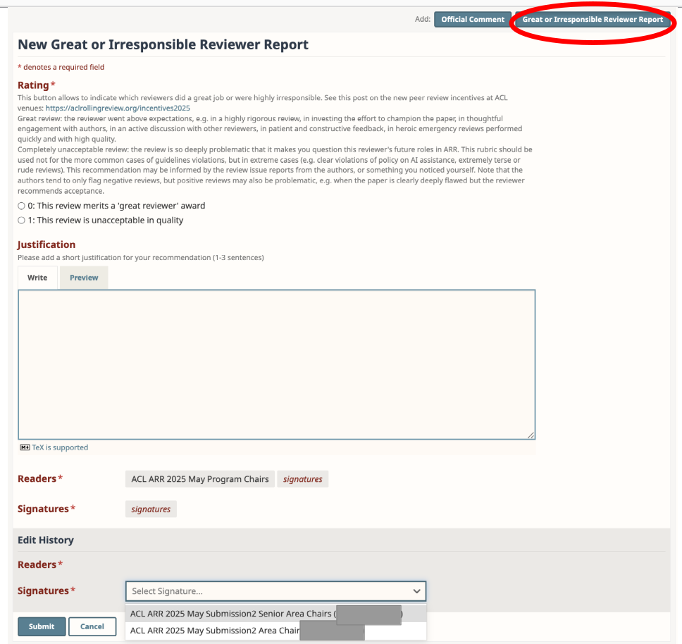

A similar form will be provided to the senior area chairs and program chairs for flagging great/unacceptable meta-reviews.

## Papers with late reviews

By the time reviews are released, there is usually a small number of papers that are still missing some reviews. If that happened to you, despite all reviewer-chasing efforts, you will have some authors who can not get the same chance to respond as the majority. 

You are not obligated to do this, but if you have papers that received late reviews, please consider enabling the authors to submit a reply, and nudging reviewers to update their assessment. You can see the date where reviews were posted to determine this. If it is logistically possible for your own workflow, consider starting the meta-review work with the other papers, and waiting to submit your meta-reviews for these papers until any author-reviewer engagement is over. 

## 🆕 Preparing a meta-review for resubmissions

When meta-reviewing a paper that is a resubmission, consider the following:

1. The authors received feedback during the previous revision and should have addressed issues identified during the first round.
2. During the subsequent submission, if the authors requested the same reviewers, then the reviewers should have focused on assessing to what extent the authors have adequately addressed the major concerns raised during the previous round. (This is also true for reviewers who are substituting for the original reviewers, if unavailable.)
3. Sometimes reviewers raise additional issues not discussed during the first round of reviews. Your job should focus on assessing how much of the past concerns you consider essential were addressed in the resubmission and write the meta-review with this in mind. Do not penalize work that represents a sincere effort to address weaknesses identified in the previous round. If resubmissions get a new round of weaknesses identified, then authors will never be able to move forward with commitment. The exception to this rule would be if the revisions resulted in contradictory findings or questionable results not present in the first round of reviews.
4. If the authors requested new reviewers, they are instructed to form their own view of the paper, and can only check the previous reviews after they submit their own review.  As such, their reviews will not be focused on the revisions, and any issues raised should receive due consideration.
5. Needless to say, a paper that is not technically sound, no matter how many resubmissions there have been, should not be deemed ready for publication.
6. Consistent with [ACL policy](https://www.aclweb.org/adminwiki/index.php?title=ACL_Policies_for_Submission,_Review_and_Citation), resubmitted papers are only required to make comparisons to highly related relevant work published at least three months prior to the **original** submission deadline, though they are encouraged to discuss contemporaneous work where feasible.
7. The scoring scales of the area chairs are different to that of the reviewers. See [here](#meta-review-form) for an explanation of the meta-review form. 

# FAQ {#faq}

## How to ask a question?

If your question is not answered in this [FAQ](#faq):

* You can always [communicate with SACs](#openreview-how-to-contact-sacs-reviewers-eics) by selecting them as readers and posting an official comment inside OpenReview
* For questions on how to use OpenReview to complete your tasks, please contact our Support Team  ([support@aclrollingreview.org](mailto:support@aclrollingreview.org));
* For technical difficulties, errors, and generally in case of suspicious behavior of the OpenReview system, please contact the Tech team ([tech@aclrollingreview.org](mailto:tech@aclrollingreview.org));
* For content-based questions (e.g., about the submissions themselves, doubts on AC decisions and tasks, concerns about reviewer assignments, etc.) please contact editors-in-chief at [editors@aclrollingreview.org](mailto:editors@aclrollingreview.org)

## [Publication ethics] How to report a publication ethics problem? {#pec}

Please refer to https://www.aclweb.org/adminwiki/index.php/Process_for_ACL_Publication_Ethics_Review for the scope and process for publication ethics violations. The link to the incident report form the individual cases of suspected misconduct is before the table of contents in that page.

The publication ethics review process is similar to the professional conduct committee process, and so cases may not be processed in time for a given cycle. This is to be expected; if misconduct is determined, sanctions may apply even post-publication. 

If you see something that you suspect to be a violation of publication ethics policy (e.g. plagiarism, violation of rules on generative AI, near-duplicate submissions, author misconduct), or a reviewer alerts you about such a suspicion, please coordinate the filing of an [incident report process for the publication ethics committee](/acguidelines#pec) as necessary, by either the reviewer, AC or the SAC. Please also leave a note about this in the forum (visible to chairs but not authors), so that there is a record of what was done.

## [OpenReview] How to create an account? 

Go to [https://openreview.net/login](https://openreview.net/login) and click on **New User** to sign up for an account (associate it with the email you were invited with)

When you create your account there are several key fields you need to fill in. In Personal Links please include the following:

* Semantic Scholar URL
* DBLP url and click “ADD DBLP Papers to profile” 
* ACL Anthology profile (leave blank if you don’t have one)
* Education and career history
* Advisor and other relation (to compute COI) 
* Expertise (please include keywords related to your area, not generic like natural language processing)

Reviewing is mutually beneficial when papers are well-matched to the reviewers. OpenReview does the matching automatically, based on the prior publication history. Hence, if your publication record is incorrect or does not reflect your current interests, you are more likely to get bad matches. 

Hence, after you have provided your Semantic Scholar ID and pulled in papers from DBLP, go through the papers listed in your profile. **Delete those that do not match your current expertise** (e.g. papers from long ago in areas in which you no longer work, papers that were for a side project). Also **delete any that you did not (co)author.**

## [OpenReview] How to find the AC console?

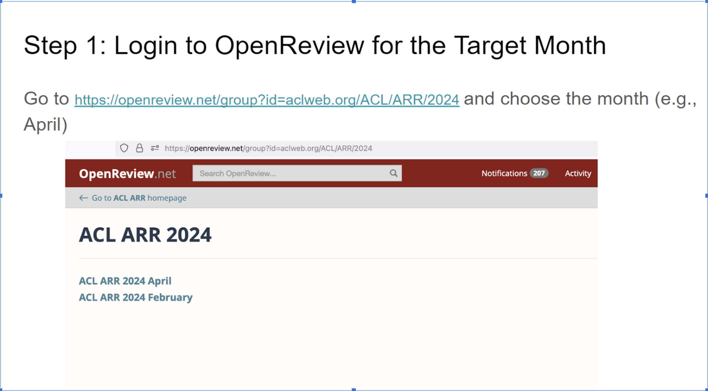

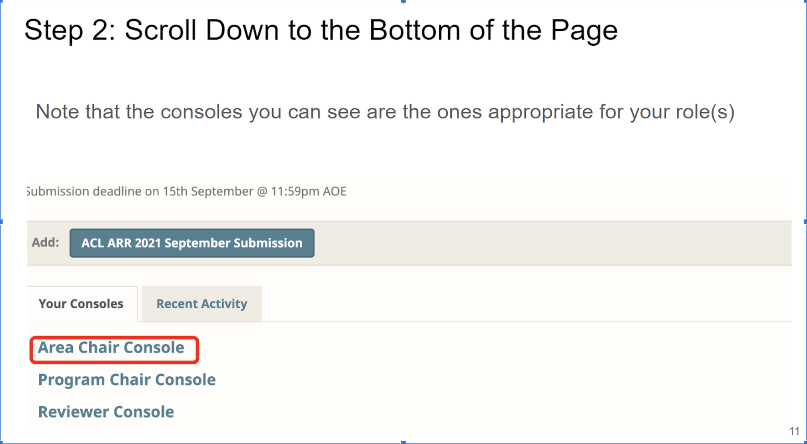

## [OpenReview] How to set maximum load? 

1) Go to the list of Area Chair tasks:
https://openreview.net/group?id=aclweb.org/ACL/ARR/**YEAR/MONTH**/Area_Chairs#area-chair-tasks
2) Click on "Area Chairs Max Load And Unavailability Request"
3) Edit your current max load and unavailability request. The AC max load is higher than reviewer load (up to 12 papers). Please consider indicating your continued availability at least for resubmissions.

## [OpenReview] How to assign reviewers? 
      
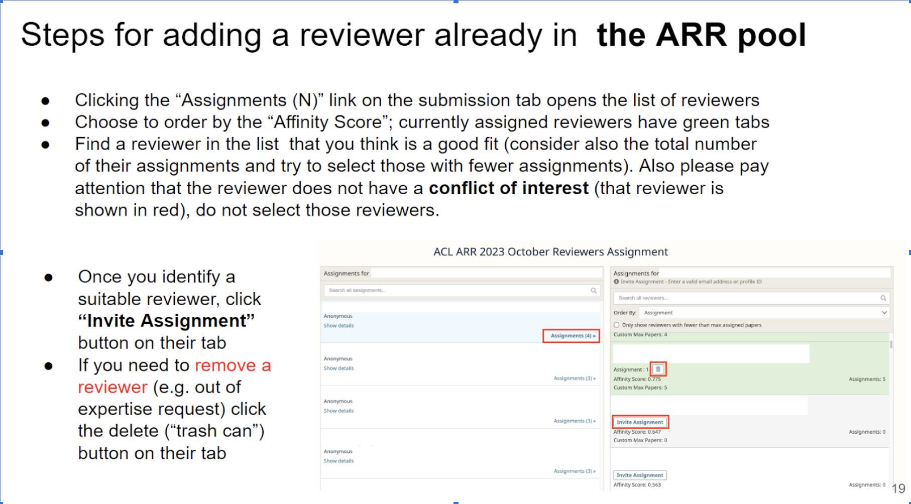

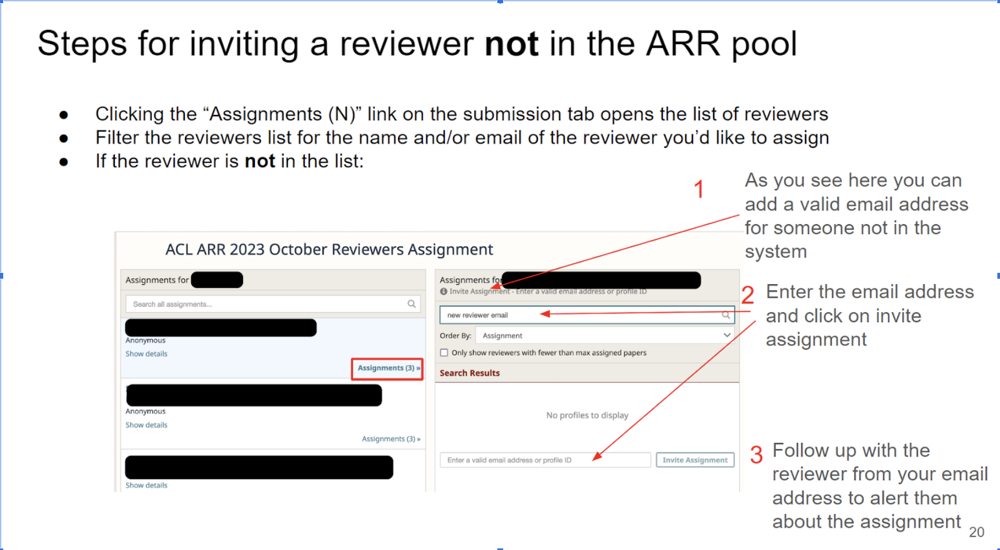

## [OpenReview] How to Contact SACs, Reviewers, EiCs? 

**Please be professional and polite** in your communications with authors, reviewers and other participants of the peer review process. To the extent possible, it is important to avoid unreasonable time frames for replies (e.g., expecting a reply on a weekend or holiday). 

* To send an email to  your SAC go to your AC console and then to your assigned papers tab.
* To contact a SAC regarding a specific paper, click on that paper and then on Add Official Comment. Write your message and select SACs as readers, (you can select to hide the message from authors or other groups, such as reviewers, too).

{:width="40%"}

There are three ways you can contact a reviewer assigned to one of your submissions:

1. From your AC console, click on the paper’s title, then click on “Official Comment”. This comment will go to all the reviewers assigned to the paper.
2. From your AC console, check the box next to the paper, then click “Message” above. This message will go to the group of reviewers you choose from the drop-down list. 

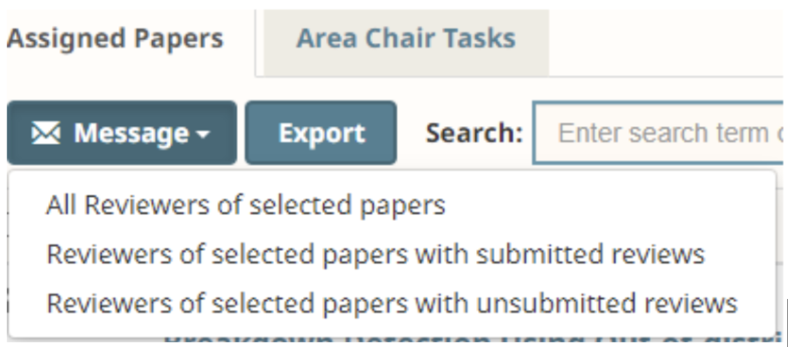{:width="40%"}

> Please note that notifications from OpenReview comments will go to reviewer's emails, and unfortunately some of them read them there and respond via email rather than OpenReview. And then their response will be routed to ARR support, and you will not see it. See [below](#openreview-how-to-find-emails-of-reviewers) for how to reach out to reviewers directly by email.

## [OpenReview] How to find emails of reviewers? 

**Option 1.** From your AC console, click on “Show reviewers” next to the paper title. You will see reviewers’ email addresses. You can then **email an individual reviewer from your own email account**. This is the recommended approach when chasing missing reviewers.

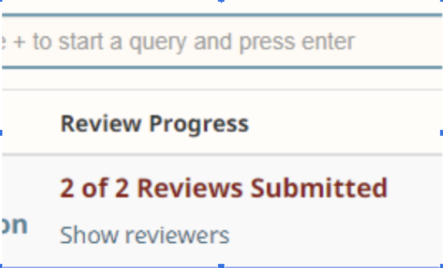{:width="40%"}

**Option 2.** From the "modify reviewer assignments" interface. This way you can browse reviewers who are not yet assigned to your papers, and reach out to them directly to confirm whether they would take an assignment. 

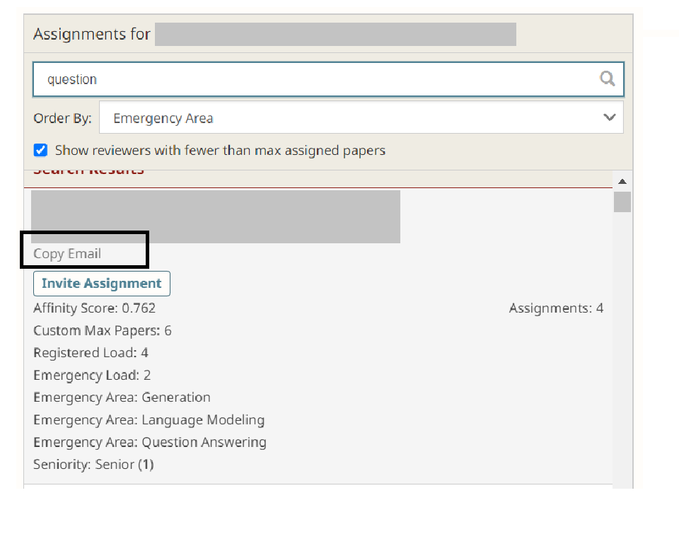{:width="40%"}

## [OpenReview] 🆕 How to use the chat feature? 

We have rolled out a new chat feature this cycle to respond to community requests. Please be mindful that this is the first cycle we use this, and as such, we may face some unforeseen issues. But in general, this chat functions as you would expect. Instructions and screenshots below.

**Posting a message in the chat:** Go to the respective paper, and scroll down to the part after the paper's metadata. There is a tab called Committee Members Chat. Click on that one and scroll down to post a new message.

**Notifications on chat messages:** the chat feature sends emails to ACs, SACs, PCs and reviewers that submitted reviews, every 5 new messages, or every 4 hours if there is a new message. You can enable browser notifications by toggling on the notifications button.

## [OpenReview] How to submit meta-review? 

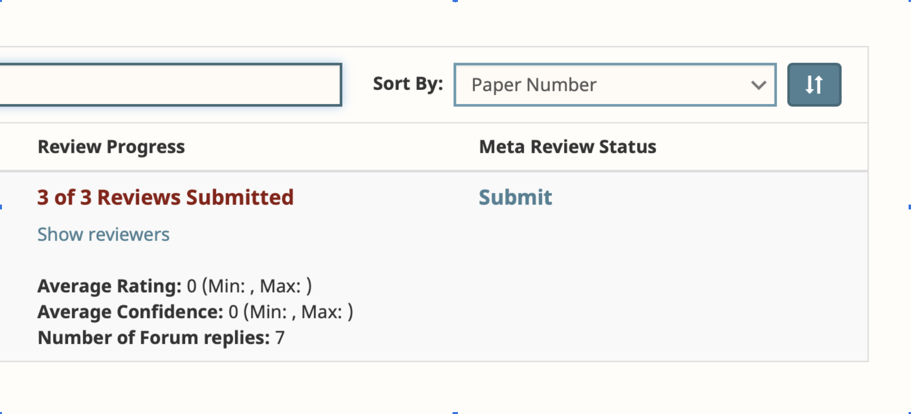

## [OpenReview] How to request a letter of recognition? 

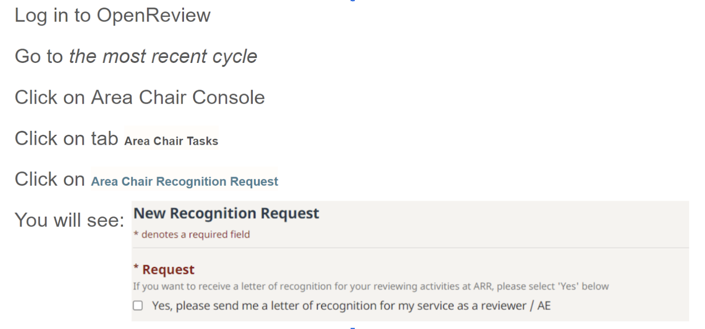

## [OpenReview] How to assign emergency reviewers? 

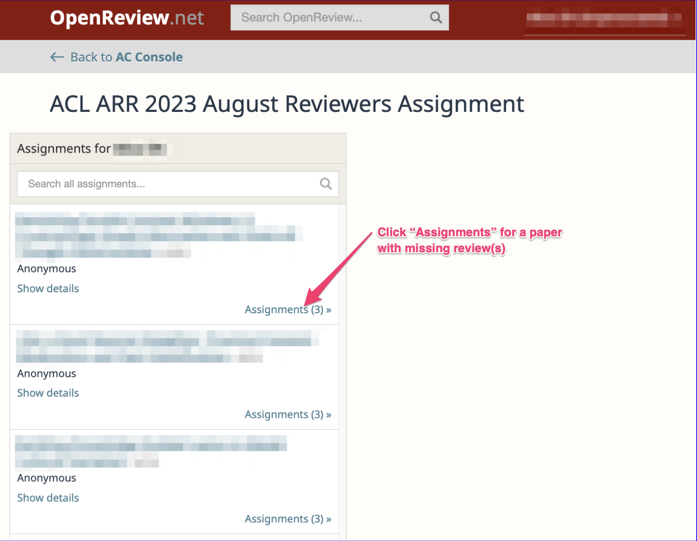

Choose "Emergency Area" (the old "Emergency" score is currently not displayed) in the "Order By" box. Ensure that assignments are less than max load, and ideally that assignments are less than emergency load, as OR does not currently keep track of regular vs emergency assignments.

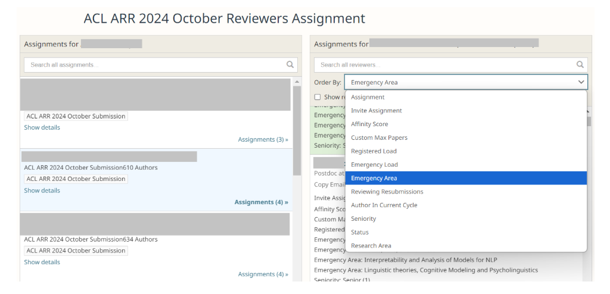

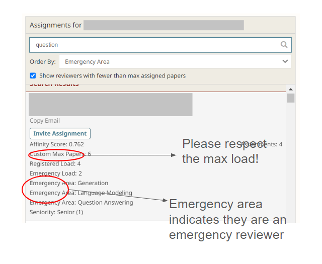

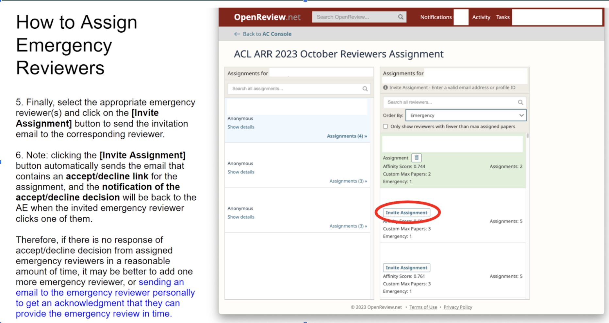

If you get an error where OpenReview doesn't create the assignments you are trying to create, it likely means that there is a cap on the number of assignments (and invitations count towards the total limit, so be careful with inviting too many people). If there are old assignments where you know that the reviewer will not submit, you can remove them to decrease the cap for a specific paper.

See [here](#openreview-how-to-find-emails-of-reviewers) for how to find reviewer emails so you could reach out to them directly. When communicating via OpenReview, sometimes people respond to email notifications directly by email instead of on OpenReview, and then they get routed to ARR support and you may lose time.

## Reviewer xyz flagged the paper for anonymity issues, what should I do? 

As of January 12, 2024, the ACL has adopted a new policy on preprints. Please review the policy before flagging the paper: [https://www.aclweb.org/adminwiki/index.php/ACL_Policies_for_Review_and_Citation](https://www.aclweb.org/adminwiki/index.php/ACL_Policies_for_Review_and_Citation)
     
# Changelog

- _01.05.2024_ Update on the new ACL review incentives policies.
- _21.10.2024_ A major update by Anna Rogers, based on internal ARR documentation and updated [reviewer guidelines](reviewerguidelines). Input from Michael White, Viviane Moreira, Marzena Karpinska.
- The first version of this document was authored with input from Goran Glavaš, Nathan Schneider, Amanda Stent and the ACL 2022 program chairs.